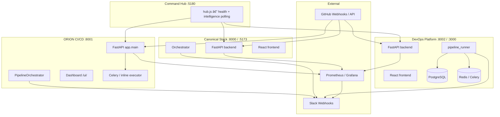

# ORION / Binary-v2 — Agents Quick Reference (§1–§23)

> **Portable baseline** extracted from [gents.md](../agents.md). For WebSocket schemas, artifact registry, state machines, production deep-dive, and Part II expansion roadmap (§24–§71), see the full master doc.

**Verify:** `.\run_e2e_all.ps1 -Offline` · **Production:** `.\run_production.ps1` · **Backlog:** `docs/audit/IMPLEMENTATION_BACKLOG.md` (Phases 0–30 ✅)

---
## 1. Vision, scope & design principles

### 1.1 Vision

ORION is evolving from an **AI-assisted CI/CD pipeline** into an **AI-native DevSecOps/SRE control plane** — analyzing code, predicting release risk, validating security and quality, orchestrating deployments, monitoring production, and safely automating remediation.

> **One-line:** An autonomous platform that turns every code change into an evidence-backed risk assessment, gated delivery decision, and observable production outcome.

Today ORION **automates the full software delivery loop** from code change to deployed, monitored service—with AI agents as specialized reviewers, testers, approvers, and operators. Human operators retain override via retry, resume, cancel, manual approval, and Auto-PR workflows.

**North-star outcomes:**

| Outcome | How ORION delivers it |
|---------|----------------------|
| **Shift-left quality** | Parallel full scan (code + security + QA) before any deploy |
| **Explainable gates** | JSON artifacts + gate fusion risk scores, not black-box chat |
| **Safe automation** | Hard security scanner rules; LLM cannot override bandit severity |
| **Operational resilience** | Checkpoint resume, webhook idempotency, auto-rollback monitoring |
| **Cross-stack visibility** | Intelligence dashboards + Command Hub SLO panel |
| **Developer velocity** | Auto-PR remediation branches; heuristic mode without API keys |

### 1.2 Advanced platform capabilities (production-ready)

| Capability | Description | Primary stack |
|------------|-------------|---------------|
| **Parallel full scan** | Code + security + QA concurrent with DB lock serialization | ORION |
| **Real SAST/SCA** | bandit + pip-audit with LLM enrichment | ORION |
| **Locust stress gate** | p95 + error rate thresholds vs staging | ORION |
| **Docker deploy + rollback** | Build, health check, LKG image restore | ORION, DevOps |
| **Simulated deploy path** | Full pipeline without Docker daemon | All stacks |
| **Monitoring auto-rollback** | 2× rollback recommendation → redeploy LKG | ORION |
| **Webhook delivery ledger** | `X-GitHub-Delivery` idempotent 202 replay | All stacks |
| **Inflight deduplication** | Same repo+commit non-terminal → 202 duplicate | ORION |
| **Stage checkpoint resume** | Skip ingest/scan/stress/approval from artifacts | All stacks |
| **Operator audit trail** | Actor, roles, action on retry/resume/cancel | All stacks |
| **Gate fusion engine** | Unified risk score 0–100 across four gates | All stacks |
| **Change risk engine** | Multi-dimensional change risk + blast radius from diff paths | ORION (+ core module in canonical) |
| **Service dependency graph** | Compose/K8s/OpenAPI heuristic graph + downstream hints | ORION |
| **SBOM generation** | CycloneDX subset from requirements/package.json | ORION |
| **Secrets Guardian** | Pattern scan + `blocked_secrets` gate on critical findings | ORION |
| **Container security** | Dockerfile heuristic scan (root, :latest, secrets) | ORION |
| **IaC security** | Terraform/K8s/Compose policy heuristics | ORION |
| **Test intelligence** | Changed-file test selection + flaky history | ORION |
| **Release passport** | Pre-deploy evidence rollup artifact | ORION |
| **Autonomous fix loop** | Sandbox verify → patch confidence → Auto-PR | ORION |
| **Progressive canary delivery** | 5→25→50→100% with health gates | ORION |
| **PR intelligence** | GitHub review comments with risk summary | ORION |
| **SLO intelligence + Slack** | Success/failure/blocked rates with deduped alerts | All stacks |
| **Hybrid file retriever** | Keyword + fuzzy path scoring for LLM context | Canonical |
| **SQLite agent memory** | Last N prompt/response pairs per agent scope | Canonical |
| **Memory Gateway** | Governed L1–L6 API; L2 episodic on terminal pipeline | ORION + Canonical (`shared/memory_gateway/`) |
| **Platform event backbone** | `pipeline.started` / `pipeline.completed` | ORION + Canonical; Hub `/control-plane/platform-events` |
| **Correlated log monitoring** | Log type + gate verdict fusion hints | All stacks |
| **Multimodal analysis suite** | 6 on-demand agents (logs, git, payment, triage, …) | ORION (+ proxy) |
| **Prometheus metrics** | HTTP counters, pipeline counters, webhook counters | ORION, Canonical |
| **Grafana dashboard JSON** | Import-ready ops dashboard | `observability/grafana/` |
| **Rate limiting** | App middleware + nginx edge zones | All stacks |
| **Multi-key RBAC** | JSON API keys with role sets | ORION, Canonical |
| **GitHub OAuth + HMAC state** | Signed OAuth state (canonical); session cookies | Canonical, ORION |
| **Playwright + pytest E2E** | Full offline verification matrix | Repo root |

### 1.3 Scope (in scope)

| Area | Description |
|------|-------------|
| **CI/CD pipelines** | Ingest → analyze → test → stress → approve → deploy → monitor |
| **Quality gates** | Code, security, QA, stress with hard blocks before deploy |
| **Multimodal analysis** | Logs, GitHub Actions, git history, payments, Dockerfiles, incident triage |
| **Auto-remediation** | Auto-PR branches for fixable findings (ORION + canonical) |
| **Cross-stack ops** | Unified intelligence dashboard, SLO alerts, Command Hub |
| **Developer UX** | Web dashboards, WebSocket live logs, REST APIs |

### 1.4 Out of scope (current)

- Unified OAuth across all three stacks (each stack has its own auth model today)
- Vector RAG / embedding store on ORION and devops (canonical has hybrid retriever only)
- Full LLM Auto-PR on devops-platform (registry metadata only)
- Managed cloud SaaS hosting (self-hosted / local-first)

### 1.5 Design principles

1. **Fail closed on security** — scanner severity cannot be downgraded by LLM; critical findings block deploy.
2. **Artifacts as source of truth** — every agent persists structured JSON; gates read artifacts, not chat output.
3. **Heuristic fallback** — pipelines complete without API keys using deterministic rules (`LLM_MODE=auto`, missing `ANTHROPIC_API_KEY`).
4. **Idempotent webhooks** — `X-GitHub-Delivery` ledger prevents duplicate pipeline runs.
5. **Minimal scope diffs** — three stacks share patterns (gate fusion, SLO, text analysis) without forced monolith.
6. **Observable by default** — `/health`, `/ready`, `/metrics`, intelligence dashboards on every stack.
7. **Defense in depth** — app rate limits + nginx zones + RBAC + secret redaction layers.
8. **Replay-safe webhooks** — delivery ledger returns cached 202; inflight dedup prevents double runs.
9. **Recoverable pipelines** — checkpoint artifacts enable resume without re-cloning or re-scanning.
10. **Observable gates** — every block status maps to a named artifact and fusion violation string.

---

## 2. System design overview

### 2.1 Logical architecture



### 2.2 Control flow (ORION — primary production path)

```
GitHub push / POST /api/v1/pipeline/trigger / dashboard trigger
        │
        â–¼
Webhook ledger (X-GitHub-Delivery idempotency)
        │
        â–¼
PipelineOrchestrator.execute_pipeline()
  ├─ 1  Ingestion           git clone, diff, metadata artifacts
  ├─ 2–4 FullScanOrchestrator (parallel, serialized DB lock)
  │       ├─ CodeAnalysisAgent   → code_analysis
  │       ├─ SecurityAgent       → security_scan
  │       └─ QAAgent             → qa_report
  ├─ 5  StressTestAgent     Locust vs STAGING_URL → stress_report
  ├─ 6  ApprovalAgent       hard rules + LLM → approval
  ├─ 7  DeploymentAgent     docker | simulate | skip | auto
  └─ 8  MonitoringAgent     background poll → monitoring_summary / monitoring_alert
        │
        â–¼
Terminal status: deployed | approved | blocked_* | rejected | failed | rolled_back | cancelled
```

### 2.3 Analysis modes

| Mode | When | Behavior |
|------|------|----------|
| **llm** | `ANTHROPIC_API_KEY` configured | Claude JSON responses with retry |
| **heuristic** | No key or LLM error | Deterministic rules in agent or `heuristic_llm.py` |
| **simulated** | QA with no `tests/` directory | Explicit skip/pass with `skipped: true` (ORION/canonical) |

### 2.4 Shared libraries (cross-stack parity)

| Module | Canonical | ORION | DevOps |
|--------|-----------|-------|--------|
| Gate fusion | `backend/core/gate_fusion.py` | `app/utils/gate_fusion.py` | `app/utils/gate_fusion.py` |
| SLO compute | `backend/core/slo.py` | `app/services/slo.py` | `app/utils/slo.py` |
| SLO alerts | `backend/core/slo_alerts.py` | `app/utils/slo_alerts.py` | `app/utils/slo_alerts.py` |
| SLO Slack notify | `backend/core/slo_alert_notifier.py` | `app/services/slo_alert_notifier.py` | `app/services/slo_alert_notifier.py` |
| Text analysis | `backend/core/text_analysis.py` | `app/utils/text_analysis.py` | via `/api/tools/text-*` |

---

## 3. Stack topology & ports

| Stack | Code path | API | UI | Primary role |
|-------|-----------|-----|-----|--------------|
| **Command Hub** | `hub/` | — | **5180** | Launcher, live health, cross-stack intelligence panel |
| **Canonical DevOps** | `backend/` + `frontend/` | **8000** | **5173** | Submit-code / archive / GitHub zip pipelines |
| **ORION CI/CD** | `ai-cicd-pipeline/` | **8001**† | `/ui/` on API | GitHub webhook → 9-stage pipeline + multimodal |
| **DevOps Platform** | `devops-platform/` | **8002**‡ | **3000**§ | Postgres + Celery agents, ORION multimodal proxy |

† `run_all_stacks.ps1` uses port **8001**; ORION `.env` default `APP_PORT=8000` when run standalone.  
‡ Docker Compose may default to **8000**; launcher uses **8002** to avoid conflict with canonical.  
§ DevOps UI defaults **3000**; launcher auto-falls back to **3001**/**3002** when the port is busy (e.g. another Vite app). Set `DEVOPS_UI_PORT` to pin. Verify title contains **Multi-Agent DevOps Platform**.

**Shared Python venv:** `Binary-v2/.venv`  
**Verify all stacks:** `.\run_e2e_all.ps1 -Offline` (run canonical pytest from `backend/` directory)

---

## 4. Pipeline architecture (all stacks)

### 4.1 ORION CI/CD (`ai-cicd-pipeline/`)

| Stage | Component | Artifact(s) | Block status |
|-------|-----------|-------------|--------------|
| Ingest | Orchestrator + GitService | `metadata`, `diff` | `failed` on clone error |
| Full scan | FullScanOrchestrator (parallel) | `full_scan_combined`, per-agent artifacts | `blocked_code`, `blocked_security`, `blocked_tests` |
| Stress | StressTestAgent | `stress_report` | `blocked_stress` |
| Approval | ApprovalAgent | `approval` | `rejected` |
| Deploy | DeploymentAgent | `deployment_info`, `last_known_good_image` | `failed`, `rolled_back` |
| Monitor | MonitoringAgent (async) | `monitoring_summary`, `monitoring_alert` | 2× rollback → `auto_rolled_back` |

**Executor:** `PIPELINE_EXECUTOR=auto|celery|inline` — Celery when Redis answers, else in-process.  
**Deploy:** `DEPLOY_MODE=auto|docker|simulate|skip`.

### 4.2 Canonical (`backend/services/orchestrator.py`)

| Stage | Agents | Artifacts in `PipelineState` |
|-------|--------|-------------------------------|
| Dev / full scan | FullScanOrchestrator (sequential) | `full_scan_combined`, `code_analysis`, `security`, `qa` |
| Auto-PR (optional) | AutoPRService | `auto_pr_registry` |
| Stress | StressAgent | `stress` |
| Approval | PipelineAgent (LLM gate decisions) | `approval`, gate decisions |
| Deploy | DeploymentAgent | `deployment` |
| Monitor | MonitoringAgent via `/analyze-logs` | `monitoring` |

**Unique:** hybrid retriever (`RETRIEVER_BACKEND`), SQLite agent memory (`AGENT_MEMORY_ENABLED`), correlated log monitoring.

### 4.3 DevOps Platform (`devops-platform/backend/app/orchestrator/pipeline_runner.py`)

| Stage | Agent | `StageResult.stage` key |
|-------|-------|-------------------------|
| Fetch | inline | metadata in `metadata_json` |
| Code | CodeAnalysisAgent | `code_analysis` |
| Security | SecurityAgent | `security` |
| QA | QAAgent | `qa` |
| Stress | StressAgent | `stress` |
| Approval | ApprovalAgent (gate fusion) | `approval` |
| Deploy | DeploymentAgent | `deployment` |
| Monitor | MonitoringAgent | `monitoring` |

**Statuses:** `PipelineStatus` enum — `PENDING` → … → `COMPLETED` | `BLOCKED` | `FAILED` | `CANCELLED`.

---

## 5. Autonomous agents (complete catalog)

### 5.1 Base classes

#### ORION `BaseAgent` (`ai-cicd-pipeline/app/agents/base_agent.py`)

| Method | Purpose |
|--------|---------|
| `async execute() -> dict` | Main agent work unit |
| `_call_claude_json()` | LLM with JSON schema retry; `{_llm_error: ...}` on failure |
| `_save_artifact(type, content, raw_output=...)` | Persist to `pipeline_artifacts` + WebSocket event |
| `_prepare_llm_text()` | Secret redaction + truncation via text_analysis |

#### DevOps `BaseAgent` (`devops-platform/backend/app/agents/base_agent.py`)

Sync `run(AgentInput) -> AgentOutput`; writes `AgentLog` + `StageResult`.

#### Canonical agents (`backend/agents/`)

LLM-driven via `LLMClient`; optional memory + retriever injection from orchestrator.

---

### 5.2 ORION pipeline agents

| # | Agent | File | Model env | Artifact | Gate |
|---|-------|------|-----------|----------|------|
| 1 | **CodeAnalysisAgent** | `code_analysis_agent.py` | `CODE_ANALYSIS_MODEL` | `code_analysis` | `severity: fail` → `blocked_code` |
| 2 | **SecurityAgent** | `security_agent.py` | `SECURITY_MODEL` | `security_scan` | `highest_severity` > `MAX_SECURITY_SEVERITY` → `blocked_security` |
| 3 | **QAAgent** | `qa_agent.py` | `QA_MODEL` | `qa_report` | `verdict: fail` → `blocked_tests` |
| 4 | **StressTestAgent** | `stress_test_agent.py` | `STRESS_MODEL` | `stress_report` | `performance_verdict: fail` → `blocked_stress` |
| 5 | **ApprovalAgent** | `approval_agent.py` | `APPROVAL_MODEL` | `approval` | `decision: rejected` → `rejected` |
| 6 | **DeploymentAgent** | `deployment_agent.py` | `DEPLOYMENT_MODEL` | `deployment_info`, `last_known_good_image` | deploy failure → `failed` / rollback |
| 7 | **MonitoringAgent** | `monitoring_agent.py` | `MONITORING_MODEL` | `monitoring_summary`, `monitoring_alert` | 2× rollback recommendation → `auto_rolled_back` |
| — | **FullScanOrchestrator** | `full_scan_orchestrator.py` | — | `full_scan_combined` | Runs 1–3 concurrently; all complete before gate eval |
| — | **PipelineOrchestrator** | `orchestrator.py` | indirect | orchestration | Coordinates all stages, Auto-PR, audit, resume |

#### Agent tool details (ORION)

**CodeAnalysisAgent**
- Tools: pylint (changed `.py`, max 20), AST scan (undefined names, unused imports, missing docstrings)
- Heuristic fail: ≥3 pylint/AST errors OR ≥5 warnings → `warn`
- Uses: `files_in_diff()`, `diff_stats()`, `_prepare_llm_text()` on diff

**SecurityAgent**
- Tools: **bandit** (full repo), **pip-audit** (pinned `==` deps in `requirements.txt`)
- LLM **cannot downgrade** scanner severity; unpinned deps → `not_audited`

**QAAgent**
- No `tests/` or `test/` → **simulated pass** (`skipped: true`, `analysis_mode: simulated`)
- Real: pytest with JSON report; failures mapped to file-level `issues` for Auto-PR
- Infrastructure errors (pytest missing) → pass with warning, not block

**StressTestAgent**
- Tool: Locust against `STAGING_URL`
- Fail: error rate >5% OR p95 >2000 ms
- Warn: error rate >1% OR p95 >1000 ms
- Unreachable staging → warn (not fail)

**ApprovalAgent**
- Hard rules first: code fail, security above threshold, QA fail, stress fail → reject without LLM override

**DeploymentAgent**
- Modes: see [§4.1](#41-orion-cicd-ai-cicd-pipeline)
- Docker: build → run → health check → rollback on failure
- Simulated: records success without Docker (`deployment_info.simulated=true`)

**MonitoringAgent**
- Polls container logs, `/health`, journald (`JOURNALD_ENABLED`)
- Simulated deploy → single-pass simulated monitoring window

---

### 5.3 Canonical pipeline agents

| Agent | File | Role | Notes |
|-------|------|------|-------|
| CodeAnalysisAgent | `agents/code_analysis.py` | LLM code review | Artifact: `code_analysis` |
| SecurityAgent | `agents/security.py` | LLM SAST-style review | **Simulated** scanners (not bandit); artifact: `security` |
| PipelineAgent | `agents/pipeline.py` | Stage transition decisions | Approval / gate LLM |
| StressAgent | `agents/stress.py` | Heuristic load gate | Artifact: `stress` |
| DeploymentAgent | `agents/deployment.py` | Deploy decision JSON | Artifact: `deployment` |
| MonitoringAgent | `agents/monitoring.py` | Log anomaly + journald | Via `/analyze-logs` |
| FullScanOrchestrator | `agents/full_scan_orchestrator.py` | Sequential scan | `full_scan_combined` |

**Memory & retrieval (canonical only):**
- `services/memory_store.py` — `SQLiteAgentMemoryStore` / `InMemoryAgentMemoryStore`
- `services/retriever.py` — `HybridFileRetriever`, `FileChunkRetriever`, `NoOpRetriever`

---

### 5.4 DevOps platform agents

| Agent | File | Gate behavior |
|-------|------|---------------|
| CodeAnalysisAgent | `code_analysis.py` | score <60 or critical issue → fail |
| SecurityAgent | `security.py` | critical vuln or `overall_risk: critical` → `BLOCKED` |
| QAAgent | `qa_agent.py` | pytest fail; no tests → explicit skip message |
| StressAgent | `stress_agent.py` | load smoke fail |
| ApprovalAgent | `approval_agent.py` | `fuse_stage_results()` fail → reject |
| DeploymentAgent | `deployment.py` | `DEPLOY_MODE` modes |
| MonitoringAgent | `monitoring.py` | post-deploy log scan |

---

## 6. Multimodal agents

Invoked on-demand via `POST /api/v1/multimodal/*` (ORION/canonical) or proxied from devops.

All extend **`BaseMultimodalAgent`** — file uploads + text, `_analyze_json()` with heuristic fallback, standalone artifacts.

| Agent | Aliases | Artifact type | Primary use |
|-------|---------|---------------|-------------|
| **LogAnalysisAgent** | `log`, `log_analysis` | `log_analysis` | Server/build/git/deploy/memory logs |
| **GitHubLogAgent** | `github`, `github_actions` | `github_log_analysis` | Actions workflow failures |
| **GitLogAgent** | `git`, `git_logs` | `git_log_analysis` | Local/remote git history |
| **PaymentAgent** | `payment` | `payment_analysis` | CSV/PDF payment reconciliation |
| **DockerfileAgent** | `docker`, `dockerfile` | `dockerfile_analysis` | Dockerfile hardening + optional auto-PR |
| **ProductionTriageAgent** | `triage`, `production_triage` | `production_triage` | P1 incident triage from screenshots/logs |

**ORION routes:** `app/api/routes/multimodal.py` — `AGENT_ALIASES` registry  
**Canonical routes:** `backend/api/multimodal.py`  
**DevOps:** `app/routers/multimodal_proxy.py` → `ORION_API_URL`

**LogAnalysisAgent enhancements:**
- Auto tail truncation (`tail_lines`)
- Heuristic: `detected_log_type`, `error_signatures`, `structured_timeline`
- Pattern fixes: `ModuleNotFoundError` → suggested `pip install …`

**Upload limits:** ORION 25 MB; canonical `MULTIMODAL_MAX_FILE_BYTES` (default 8 MB)

---

## 7. Orchestration, lifecycle & control plane

### 7.1 Triggers

| Stack | Trigger sources |
|-------|-----------------|
| ORION | GitHub `push` webhook, `POST /api/v1/pipeline/trigger`, dashboard |
| Canonical | `POST /submit-code`, `/submit-archive`, `/submit-github`, `POST /api/v1/webhook/github` |
| DevOps | `POST /webhook/github`, `POST /api/pipeline/trigger` |

### 7.2 Operator actions

| Action | ORION | Canonical | DevOps |
|--------|-------|-----------|--------|
| **Retry** (full restart) | `POST /api/v1/pipeline/runs/{id}/retry` | `POST /pipelines/{id}/retry` | `POST /api/pipeline/{id}/retry` |
| **Resume** (checkpoint) | `POST /api/v1/pipeline/runs/{id}/resume` | `POST /pipelines/{id}/resume` | `POST /api/pipeline/{id}/resume` |
| **Cancel** | `POST /api/v1/pipeline/runs/{id}/cancel` | `POST /pipelines/{id}/cancel` | `POST /api/pipeline/{id}/cancel` |
| **Audit trail** | `GET /runs/{id}/audit` | `GET /pipelines/{id}/audit` | `GET /api/pipeline/{id}/audit` |
| **Manual deploy** | via approval flow | `POST /trigger-deployment` | `POST /api/pipeline/{id}/deploy` |

### 7.3 Resume checkpoint semantics

**ORION** skips completed stages when artifacts exist:
- Skip ingest if `metadata`
- Skip full scan if `full_scan_combined` or all three scan artifacts
- Skip stress if `stress_report`
- Skip approval if prior `approval.decision == approved`

**Canonical** skips when `resume=True`:
- Skip full scan if `full_scan_combined`
- Skip auto-PR if `auto_pr_registry` exists
- Skip stress if `stress` artifact exists

**DevOps** skips stages with existing `StageResult` rows when `metadata_json.resume=true`.

### 7.4 Auto-PR

| Stack | Branch pattern | Artifact |
|-------|----------------|----------|
| ORION | `orion/fix-<category>-<run>` | `auto_pr_registry` |
| Canonical | AutoPRService branches | `auto_pr_registry` |
| DevOps | metadata registry on block | `metadata_json` |

Status `blocked_with_prs_sent` when fix PRs are opened and pipeline waits for merge.

### 7.5 WebSocket live events

| Stack | Endpoint | Events |
|-------|----------|--------|
| ORION | `WS /ws/pipeline/{id}` | `stage-update`, `agent-complete` |
| Canonical | `WS /ws/pipeline-status/{id}` | stage/status messages |
| DevOps | `WS /ws/{pipeline_id}` | stage log stream |

Auth: `?api_key=` when `API_REQUIRE_AUTH=true` (ORION/devops).

---

## 8. API reference (unified)

### 8.1 Health & ops (all stacks)

| Method | Path | Purpose |
|--------|------|---------|
| GET | `/health` | Liveness + diagnostic JSON |
| GET | `/ready` | Readiness (DB, executor, preflight) |
| GET | `/metrics` | Prometheus text exposition |

### 8.2 ORION (`ai-cicd-pipeline/app/main.py`)

**Prefix:** `/api/v1`

| Method | Path | Auth | Purpose |
|--------|------|------|---------|
| POST | `/webhook/github` | HMAC | Push webhook + delivery ledger |
| POST | `/webhook/github/pr` | HMAC | Merged PR branch cleanup |
| GET | `/pipeline/runs` | optional | List runs |
| GET | `/pipeline/runs/{id}` | optional | Run detail |
| GET | `/pipeline/runs/{id}/artifacts` | optional | All artifacts |
| GET | `/pipeline/runs/{id}/artifacts/{type}` | optional | Single artifact |
| GET | `/pipeline/runs/{id}/audit` | optional | Audit trail |
| POST | `/pipeline/runs/{id}/retry` | operator | Full retry |
| POST | `/pipeline/runs/{id}/resume` | operator | Checkpoint resume |
| POST | `/pipeline/runs/{id}/cancel` | operator | Cancel |
| POST | `/pipeline/trigger` | operator | Manual trigger |
| GET | `/intelligence/dashboard` | optional | SLO + gate fusion + alerts |
| GET | `/production/checklist` | optional | Production hardening score + items |
| GET | `/production/ready` | optional | Runtime + hardening gate (503 if not ready in prod) |
| POST | `/tools/text-analyze` | optional | Text utilities batch |
| POST | `/tools/text-sanitize` | optional | Sanitize + redact |
| POST | `/tools/text-compare` | optional | Similarity |
| POST | `/multimodal/analyze` | optional | Multimodal router |
| POST | `/multimodal/triage` | optional | Production triage |
| POST | `/multimodal/git-logs` | optional | Git log analysis |
| POST | `/multimodal/payment` | optional | Payment analysis |
| GET | `/auth/github` | open | OAuth start |
| GET | `/auth/github/callback` | open | OAuth callback |
| GET | `/auth/me`, `/logout`, `/status` | session | Session info |

Headers: `X-ORION-API-Key`, `X-Hub-Signature-256`, `X-GitHub-Delivery`, `X-GitHub-Event`

### 8.3 Canonical (`backend/main.py`)

| Method | Path | Auth | Purpose |
|--------|------|------|---------|
| POST | `/submit-code` | rate limit | Start pipeline from code payload |
| POST | `/submit-archive` | rate limit | Zip upload pipeline |
| POST | `/submit-github` | rate limit | GitHub archive pipeline |
| GET | `/pipeline-status/{id}` | open | Status |
| GET | `/pipelines` | open | List |
| POST | `/pipelines/{id}/cancel` | optional | Cancel |
| POST | `/pipelines/{id}/retry` | optional | Retry |
| POST | `/pipelines/{id}/resume` | optional | Resume |
| GET | `/pipelines/{id}/audit` | optional | Audit |
| POST | `/trigger-deployment` | approver key | Manual deploy |
| POST | `/analyze-logs` | open | Monitoring + gate correlation |
| POST | `/api/v1/webhook/github` | HMAC | Push webhook + ledger |
| POST | `/api/v1/webhook/github/pr` | HMAC | PR merge webhook |
| GET | `/api/v1/intelligence/dashboard` | open | Intelligence |
| GET | `/runtime-config` | open | Frontend preflight |
| POST | `/api/v1/multimodal/analyze` | optional | Multimodal |
| POST | `/api/v1/multimodal/triage` | optional | Triage |

### 8.4 DevOps Platform

| Method | Path | Auth | Purpose |
|--------|------|------|---------|
| POST | `/webhook/github` | HMAC | GitHub webhook |
| POST | `/api/pipeline/trigger` | optional | Start pipeline |
| GET | `/api/pipelines` | open | List |
| GET | `/api/pipeline/{id}` | open | Detail + logs + stages |
| GET | `/api/pipeline/{id}/status` | open | Light status |
| GET | `/api/pipeline/{id}/audit` | open | Audit |
| POST | `/api/pipeline/{id}/retry` | optional | Retry |
| POST | `/api/pipeline/{id}/resume` | optional | Resume |
| POST | `/api/pipeline/{id}/cancel` | optional | Cancel |
| POST | `/api/pipeline/{id}/logs/analyze` | open | Log analyze + fusion |
| POST | `/api/pipeline/{id}/deploy` | `X-Deployment-Key` | Manual deploy |
| GET | `/api/intelligence/dashboard` | open | Intelligence |
| POST | `/api/multimodal/analyze` | optional | ORION proxy |
| POST | `/api/tools/text-*` | open | Text tools |

---

## 9. Cross-stack intelligence & gate fusion

### 9.1 Intelligence dashboards

| Stack | Endpoint | Response highlights |
|-------|----------|---------------------|
| Canonical | `GET /api/v1/intelligence/dashboard` | pass_rate, top_blockers, SLO, alerts, retriever/memory flags |
| ORION | `GET /api/v1/intelligence/dashboard` | deploy_mode, executor, llm_mode, auto_pr capability |
| DevOps | `GET /api/intelligence/dashboard` | redis_available, approval_agent, ORION proxy flag |

**Command Hub** (`hub/hub.js`) polls all three every few seconds and renders SLO success, readiness, gate blockers, alert banner.

### 9.2 Gate fusion (`fuse_stage_results`)

Merges code, security, QA, stress into:
- `verdict`: `pass` | `warn` | `fail`
- `violations`, `warnings`, `risk_score` (0–100)
- `recommended_action`

Used in intelligence blockers, ApprovalAgent (devops), correlated monitoring.

### 9.3 SLO & alerts

**Compute** (`compute_pipeline_slo`): `success_rate`, `blocked_rate`, `failure_rate`, `mean_duration_seconds` over recent runs.

**Evaluate** (`evaluate_slo_alerts`):
- `slo_success_low` — success below 70% (min 3 runs)
- `slo_failure_high` — failure above 25%
- `slo_blocked_high` — blocked above 40%

**Notify** (`notify_slo_alerts`): posts to Slack with per-code cooldown (`SLO_ALERT_COOLDOWN_SECONDS`, default 3600).

---

## 10. Security conduct & trust boundaries

### 10.1 Security principles

| Principle | Implementation |
|-----------|----------------|
| **Authenticate webhooks** | HMAC-SHA256 `X-Hub-Signature-256`; never use GitHub PAT as webhook secret |
| **Never commit secrets** | Use `.env` (gitignored); redact before LLM via `redact_secrets()` |
| **Least privilege API keys** | RBAC roles: `admin`, `operator`, `approver` in `AUTH_API_KEYS_JSON` |
| **Rate limit abuse surfaces** | submit, webhook, multimodal, trigger endpoints |
| **Fail closed on auth** | `API_REQUIRE_AUTH=true` in production (ORION auto-enforces in prod) |
| **Sandbox user code** | Archive/pytest runs in temp dirs; document trust boundary for `/submit-archive` |
| **Idempotent delivery** | `webhook_deliveries` table keyed by `X-GitHub-Delivery` |

### 10.2 Authentication matrix

| Mechanism | ORION | Canonical | DevOps |
|-----------|-------|-----------|--------|
| GitHub OAuth | ✅ `/api/v1/auth/github` | ✅ same pattern | — |
| Session cookies | Signed via `SESSION_SECRET_KEY` | Same | — |
| API keys | `X-ORION-API-Key` + `AUTH_API_KEYS_JSON` | `AuthService` + DB `User` | `X-ORION-API-Key`, `DEPLOYMENT_API_KEY` |
| RBAC | `OrionAuthService.require_roles()` | roles in JSON + DB | binary key match |
| WebSocket auth | `?api_key=` | optional | `?api_key=` |

**ORION roles (typical):**
- `admin` — all operations
- `operator` — retry, cancel, resume, trigger
- `approver` — deployment approval (canonical `/trigger-deployment`)

### 10.3 Secret handling in agents

Before any LLM call, text passes through:
1. `sanitize_for_agent()` — unicode normalize
2. `redact_secrets()` — API keys, tokens, PEM blocks, common patterns
3. `truncate_with_context()` — head+tail for large diffs/logs

### 10.4 Scanner trust (ORION SecurityAgent)

- Bandit and pip-audit outputs are **authoritative**
- LLM may add context but **cannot reduce** scanner severity
- Unpinned requirements → listed as `not_audited`

### 10.5 Production checklist

**Automated (ORION):**

| Check | Mechanism |
|-------|-----------|
| Hardening score 0–100 | `GET /api/v1/production/checklist` — `app/utils/production_hardening.py` |
| Fail-closed startup | `settings.validate_startup()` in ORION lifespan (secrets, Postgres, API keys) |
| Combined readiness | `GET /api/v1/production/ready` — `/ready` + hardening (503 when `APP_ENV=production` and not ready) |
| Cross-stack preflight | `scripts/production_preflight.py` — validates all three `.env.production` files |
| CLI | `orion production checklist` · `orion production ready` |

**Manual checklist (real cloud deploy):**

- [ ] Rotate `SECRET_KEY`, `SESSION_SECRET_KEY`, `GITHUB_WEBHOOK_SECRET`, all API keys
- [ ] Set `APP_ENV=production` and `API_REQUIRE_AUTH=true` (auto-enabled on ORION when `APP_ENV=production`)
- [ ] Configure `AUTH_API_KEYS_JSON` with scoped RBAC keys (or `ORION_API_KEY`)
- [ ] Use dedicated webhook secret (never `GITHUB_TOKEN`)
- [ ] Enable HTTPS termination (nginx `orion.conf` or cloud LB)
- [ ] Restrict `CORS_ORIGINS` to known UI origins (no `*`)
- [ ] Use PostgreSQL + Redis (`docker-compose.prod.yml`); enable TLS on managed Postgres
- [ ] Enable recommended gates: `PROMPT_INJECTION_GATE_ENABLED`, `POLICY_ENFORCEMENT_ENABLED`, `UNIFIED_RISK_GATE_ENABLED`
- [ ] Never commit `.env` / `.env.production` — root `.env.example` uses placeholders only
- [ ] Replace auto-generated GitHub/Slack/LLM tokens before external exposure

**Local production simulation (`PRODUCTION_LOCAL_SIM=true`):** Auth + gates on, SQLite + inline executor — for laptops without Docker. Not a substitute for Postgres/Celery in real production. See [§11.6](#116-production-deployment-paths).

---

## 11. Encrypted & hardened deployment plan

Recommended production topology with encryption in transit and at rest.

### 11.1 Network & TLS

```
                    ┌─────────────────┐
   Internet ───────►│ TLS Termination │  nginx / cloud LB (TLS 1.2+)
                    │  (HTTPS :443)   │
                    └────────┬────────┘
                             │ HTTP internal (VPC only)
         ┌───────────────────┼───────────────────┐
         â–¼                   â–¼                   â–¼
   ORION API :8001    Canonical :8000      DevOps :8002
```

- **In transit:** TLS at edge; internal mTLS optional between services
- **Webhooks:** GitHub → HTTPS only; validate HMAC on raw body
- **Session cookies:** `https_only=True`, `same_site=lax` or `strict` in production

### 11.2 Secrets management (recommended)

| Layer | Dev | Production |
|-------|-----|------------|
| App secrets | `.env` file (gitignored) | Vault / AWS Secrets Manager / Azure Key Vault |
| DB credentials | local SQLite / docker env | Rotated Postgres user; TLS connection string |
| API keys | `AUTH_API_KEYS_JSON` | Per-service keys with expiry; audit access |
| LLM keys | `ANTHROPIC_API_KEY` | Scoped key; rate limits; no logging of prompts with secrets |

### 11.3 Data at rest

| Data | Encryption approach |
|------|---------------------|
| Postgres (devops/ORION prod) | Provider-managed disk encryption (RDS, Cloud SQL) |
| SQLite (local dev) | File permissions; not for production |
| Artifacts (JSON in DB) | Already redacted at ingest; optional column-level encryption for PII |
| Agent memory (canonical SQLite) | `AGENT_MEMORY_ENABLED` store — encrypt file or move to encrypted DB |
| Webhook ledger | No sensitive payload storage; response bodies are status metadata |

### 11.4 Hardening controls

| Control | Technology |
|---------|------------|
| WAF / rate limit | nginx `limit_req`, cloud WAF, in-app `RateLimitMiddleware` |
| Container isolation | Docker deploy with non-root user, read-only rootfs where possible |
| SBOM / deps | pip-audit in ORION SecurityAgent; CI `pip audit` / Dependabot |
| Audit | `audit_trail` artifacts + operator action logs on retry/cancel/resume |
| Monitoring | Prometheus scrape `/metrics`; Grafana dashboard in `observability/grafana/` |
| Alerting | Slack SLO alerts + pipeline blocked/failed notifications |

### 11.5 Zero-trust operator access

1. Operators authenticate via GitHub OAuth or scoped API key
2. Sensitive actions (retry, resume, cancel, trigger) require `operator` role
3. Deploy approval requires `approver` role or `X-Deployment-Key`
4. All actions append to audit trail with actor + roles + timestamp

### 11.6 Production deployment paths

| Path | When | Infra | Env files |
|------|------|-------|-----------|
| **Development** | Daily coding | SQLite, inline executor | `.env` per stack |
| **Local production sim** | Auth/gate testing without Docker | SQLite, `PRODUCTION_LOCAL_SIM=true` | `scripts/generate_production_env.py --local-sim` |
| **Production (self-hosted)** | Real deploy | `docker-compose.prod.yml` — Postgres + Redis | `*.env.production` from `*.env.production.example` |

**Launcher:** `.\run_production.ps1` — optional `-GenerateSecrets`, `-LocalSim`, `-SkipDocker`, `-SkipPreflight`

```
generate_production_env.py  →  .env.production (×3) + .env.prod.infra
production_preflight.py     →  exit 1 on placeholder / hardening failures
run_production.ps1          →  Docker infra + preflight + run_all_stacks.ps1 (per-stack env)
```

**Per-stack production templates:**

| Stack | Template | Module |
|-------|----------|--------|
| ORION | `ai-cicd-pipeline/.env.production.example` | `production_hardening.py`, `validate_startup()` |
| Canonical | `backend/.env.production.example` | `check_required_env_vars()` |
| DevOps | `devops-platform/.env.production.example` | `Settings.validate_startup()` |

**Postgres databases** (created by `docker/postgres-init/01-databases.sql`): `orion`, `canonical`, `devops_platform`

**TLS (local nginx testing):** `scripts/generate_local_tls.ps1` → `observability/tls/local/` — mount per `ai-cicd-pipeline/nginx/conf.d/orion.conf`

Full guide: `docs/PRODUCTION_RUNBOOK.md`

---

## 12. Observability, SLO & operations

### 12.1 Metrics (Prometheus)

| Stack | Key series |
|-------|------------|
| ORION | `orion_http_requests_total`, `orion_http_request_duration_seconds_*`, `orion_pipeline_runs_total`, `orion_webhook_deliveries_total` |
| Canonical | `canonical_http_requests_total`, `canonical_pipeline_submissions_total` |
| DevOps | `devops_platform_up` |

Scrape config example: `observability/grafana/README.md`  
Dashboard JSON: `observability/grafana/orion-dashboard.json`

### 12.2 Readiness vs liveness

| Endpoint | Checks |
|----------|--------|
| `/health` | Process up, config summary, LLM mode |
| `/ready` | DB connectivity, executor (ORION), preflight secrets (canonical) |

Command Hub displays readiness badges per stack.

### 12.3 Slack notifications

| Event | Source |
|-------|--------|
| Pipeline started / blocked / completed / failed | Stack `SlackService` |
| SLO breach | `notify_slo_alerts()` on intelligence dashboard poll |
| Production triage (high severity) | Canonical multimodal optional alert |

Config: `SLACK_WEBHOOK_URL`, `SLO_ALERT_SLACK_ENABLED`, `SLO_ALERT_COOLDOWN_SECONDS`

### 12.4 Runbook snippets

**Pipeline blocked on security (ORION):**
1. `GET /api/v1/pipeline/runs/{id}/artifacts/security_scan`
2. Fix findings or adjust `MAX_SECURITY_SEVERITY` (non-prod only)
3. `POST .../retry` or `/resume` if checkpoint exists

**Webhook duplicate deliveries:**
- Expected: second delivery returns `202` with cached `response_body` from ledger

**SLO alert storm:**
- Increase `SLO_ALERT_COOLDOWN_SECONDS`; fix underlying gate blockers via intelligence `top_blockers`

---

## 13. Data model & persistence

### 13.1 ORION (`ai-cicd-pipeline/`)

**Tables:**
- `pipeline_runs` — UUID, commit, branch, repo, status (40+ values), timestamps
- `pipeline_artifacts` — JSON/JSONB content, 22 valid types
- `webhook_deliveries` — idempotent GitHub delivery ledger

**Migrations:** `alembic/versions/001_initial.py`, `002_webhook_deliveries.py`

**Valid artifact types:** `metadata`, `diff`, `code_analysis`, `security_scan`, `qa_report`, `stress_report`, `change_risk_report`, `service_graph`, `sbom`, `secrets_scan`, `container_security_scan`, `iac_security_scan`, `test_intelligence`, `release_passport`, `approval`, `deployment_info`, `last_known_good_image`, `monitoring_summary`, `monitoring_alert`, `full_scan_combined`, `auto_pr_registry`, `audit_trail`, multimodal types (see §6)

**Terminal statuses:** `deployed`, `approved`, `blocked_*`, `rejected`, `failed`, `rolled_back`, `auto_rolled_back`, `cancelled`

### 13.2 Canonical

**Tables (`backend/models/db_models.py`):**
- `pipeline_runs`, `stage_results`, `logs`, `users`, `webhook_deliveries`

**State:** In-memory / SQLite `PipelineState` via `services/state_store.py` (primary runtime)

**Agent memory:** separate SQLite table via `SQLiteAgentMemoryStore`

### 13.3 DevOps Platform

**Tables (`app/models.py`):**
- `pipeline_runs`, `agent_logs`, `stage_results`, `webhook_deliveries`

**Migrations:** `devops-platform/backend/alembic/versions/001_initial.py`, `002_webhook_deliveries.py`

### 13.4 Audit trails

| Stack | Storage | API |
|-------|---------|-----|
| ORION | artifact `audit_trail` | `GET /runs/{id}/audit` |
| Canonical | `state.artifacts.audit_trail` | `GET /pipelines/{id}/audit` |
| DevOps | `audit_trail.py` service | `GET /api/pipeline/{id}/audit` |

Events: `pipeline.retry`, `pipeline.resume`, `pipeline.cancel`, deployment approvals, etc.

---

## 14. Text analysis utilities

**Modules (parity):**
- `backend/core/text_analysis.py`
- `ai-cicd-pipeline/app/utils/text_analysis.py`

### 14.1 Functions

| Function | Use case |
|----------|----------|
| `redact_secrets()` | Strip API keys, tokens, PEM before LLM/logs |
| `sanitize_for_agent()` | Normalize unicode + redact |
| `truncate_with_context()` | Head+tail truncation for large diffs/logs |
| `files_in_diff()` / `diff_stats()` | Diff parsing without repo checkout |
| `classify_log_type()` | server_timeout · build_error · deployment_crash · … |
| `extract_error_signatures()` | Deduplicated error fingerprints |
| `extract_stack_traces()` | Parse Python tracebacks |
| `extract_log_timeline()` | Timestamp + severity events |
| `parse_commit_message()` | Conventional commit parser |
| `similarity_ratio()` | Fuzzy text comparison |
| `string_metrics()` | Lines, words, error counts, fingerprint |
| `run_text_operations()` | Batch operations for API |

### 14.2 API

```bash
curl -s -X POST http://localhost:8001/api/v1/tools/text-analyze \
  -H "Content-Type: application/json" \
  -d '{"text":"ERROR connection timed out","operations":["metrics","classify_log","errors","sanitize"]}'
```

**Valid `operations`:** `metrics` · `redact` · `redact_secrets` · `sanitize` · `classify_log` · `timeline` · `errors` · `error_signatures` · `stack_traces` · `truncate` · `fingerprint` · `diff_stats` · `commit`

**Endpoints:**

| Stack | Paths |
|-------|-------|
| ORION / Canonical | `POST /api/v1/tools/text-analyze`, `/text-sanitize`, `/text-compare` |
| DevOps | `POST /api/tools/text-analyze`, `/text-sanitize`, `/text-compare` |

---

## 15. User interfaces & Command Hub

| Surface | Path | URL | Features |
|---------|------|-----|----------|
| **Command Hub** | `hub/` | `:5180` | Stack cards, health/ready probes, intelligence panel, cross-links |
| **Canonical console** | `frontend/` | `:5173` | `#/pipeline`, `#/intelligence`, `#/operations`; NavHub bar |
| **ORION dashboard** | `ai-cicd-pipeline/frontend/` | `:8001/ui/` | 9-stage timeline, WebSocket logs, multimodal modals, retry/cancel/resume |
| **DevOps UI** | `devops-platform/frontend/` | `:3000` (fallback `:3001`/`:3002`) | Pipeline view, WS hook, multimodal via ORION proxy |

If `:3000` shows a non-ORION app, stop that process or read the launcher banner for the actual DevOps UI port.

**Frontend env (`frontend/.env.example`):** `VITE_API_BASE_URL`, `VITE_HUB_URL`, `VITE_ORION_API_URL`, `VITE_DEVOPS_API_URL`, etc.

---

## 16. Configuration reference

### 16.1 Core environment variables (all stacks)

| Variable | Affects |
|----------|---------|
| `ANTHROPIC_API_KEY` | All LLM agents (heuristic if missing) |
| `*_MODEL` per agent | Claude model slug per stage |
| `DEPLOY_MODE` | `auto` · `docker` · `simulate` · `skip` |
| `STAGING_URL` | Stress + deploy health checks |
| `SLACK_WEBHOOK_URL` | Pipeline + SLO Slack alerts |
| `SLO_ALERT_SLACK_ENABLED` | Toggle SLO Slack (default `true`) |
| `SLO_ALERT_COOLDOWN_SECONDS` | Alert dedupe window (default `3600`) |
| `GITHUB_WEBHOOK_SECRET` | Webhook HMAC (not the GitHub token) |
| `GITHUB_TOKEN` | Clone, statuses, Auto-PR |
| `API_REQUIRE_AUTH` | Protect pipeline + tools APIs |
| `AUTH_API_KEYS_JSON` | Multi-key RBAC map |
| `APP_ENV` | `production` enables fail-closed auth + startup validation |
| `PRODUCTION_LOCAL_SIM` | `true` — SQLite allowed in production mode (local sim only) |

**Production env files (gitignored):** copy `*.env.production.example` → `.env.production` per stack, or run `python scripts/generate_production_env.py`.

### 16.2 ORION-specific (`ai-cicd-pipeline/.env.example`)

| Variable | Purpose |
|----------|---------|
| `PIPELINE_EXECUTOR` | `auto` · `celery` · `inline` |
| `MAX_SECURITY_SEVERITY` | Security gate threshold |
| `STRESS_TEST_*` | Locust users, duration, spawn rate |
| `MONITORING_*` | Poll interval, window, health timeout |
| `ORION_API_KEY` | Legacy automation key |
| `RATE_LIMIT_*` | In-app rate limiting |
| `CONTAINER_REGISTRY`, `APP_NAME` | Docker deploy targets |

Per-agent models:
```
CODE_ANALYSIS_MODEL=claude-sonnet-4-20250514
SECURITY_MODEL=claude-sonnet-4-20250514
QA_MODEL=claude-sonnet-4-20250514
STRESS_MODEL=claude-sonnet-4-20250514
APPROVAL_MODEL=claude-sonnet-4-20250514
DEPLOYMENT_MODEL=claude-sonnet-4-20250514
MONITORING_MODEL=claude-sonnet-4-20250514
```

### 16.3 Canonical-specific

| Variable | Purpose |
|----------|---------|
| `QA_MODE` | `simulated` · `real` |
| `LLM_MODE` | `auto` · `mock` · `live` |
| `AGENT_MEMORY_ENABLED` | SQLite agent memory |
| `RETRIEVER_BACKEND` | `hybrid` · `files` · `chunk` · `noop` |
| `AUTO_PR_ENABLED` | Auto-PR on blockers |
| `AUTO_REDEPLOY_ON_BLOCKED` | Auto-remediation path |
| `PIPELINE_EXECUTOR` | Queue backend selection |
| `MULTIMODAL_*` | Auth, size limits, timeouts |

### 16.4 DevOps-specific

| Variable | Purpose |
|----------|---------|
| `DATABASE_URL` / `SYNC_DATABASE_URL` | Postgres async + sync |
| `REDIS_URL`, `CELERY_*` | Celery broker |
| `ORION_API_URL` | Multimodal proxy target |
| `DEPLOYMENT_API_KEY` | Manual deploy header |
| `AUTO_PR_ENABLED` | Registry on block |

---

## 17. Integrations (GitHub, Slack, Docker, Celery)

| Integration | ORION | Canonical | DevOps |
|-------------|-------|-----------|--------|
| GitHub push webhook | ✅ HMAC + ledger | ✅ HMAC + ledger | ✅ HMAC + ledger |
| GitHub PR webhook | ✅ branch cleanup | ✅ Auto-PR merge | — |
| Commit statuses | ✅ `GitHubService` | ✅ | ✅ |
| Slack pipeline alerts | ✅ | ✅ | ✅ |
| Slack SLO alerts | ✅ | ✅ | ✅ |
| Docker deploy | ✅ DeploymentAgent | LLM agent | ✅ deployment.py |
| Celery/Redis | ✅ optional | memory/redis queue | ✅ primary path |
| Auto-PR | ✅ full service | ✅ full service | metadata only |

---

## 18. Testing & verification

### 18.1 Test locations

| Path | Coverage |
|------|----------|
| `backend/tests/` | API, orchestrator, gate fusion, intelligence, SLO, webhook ledger, resume, multimodal, retriever |
| `ai-cicd-pipeline/tests/` | Agents, orchestrator, webhook, multimodal, migrations, runtime, security |
| `devops-platform/tests/` | Webhooks, agents, approval, pipeline API, WS, dispatch, audit |
| `e2e/tests/` | Playwright hub + optional stack `/ready` smoke |

### 18.2 Commands

```powershell
# Full offline verification
.\run_e2e_all.ps1 -Offline

# Canonical only (must cd into backend)
cd backend; ..\.venv\Scripts\pytest tests/ -v

# ORION unit tests
cd ai-cicd-pipeline; ..\.venv\Scripts\pytest tests/test_agents/ tests/test_text_analysis.py -v

# Playwright hub
cd e2e; npx playwright test tests/hub.spec.ts tests/stacks.spec.ts
```

### 18.3 ORION offline E2E

`ai-cicd-pipeline/scripts/e2e_run.py --scenario pass --offline` — spins sample repo + staging mock + full pipeline.

---

## 19. Launchers & scripts

| Script | Purpose |
|--------|---------|
| `run_all_stacks.ps1` | Hub :5180 + canonical :8000/:5173 + ORION :8001 + devops :8002/:3000+ (auto port fallback) |
| `scripts/run_preflight_check.ps1` | Wrapper for `production_preflight.py` (exit code gate) |
| `run_local_all.ps1` | Canonical only (+ optional `-WithHub`) |
| `stop_local_all.ps1` | Stop PIDs from `.local_stacks.json` |
| `run_e2e_all.ps1` | Full test matrix |
| `run_production.ps1` | Production launcher (secrets, Docker, preflight, all stacks) |
| `scripts/generate_production_env.py` | Generate `.env.production` + `.env.prod.infra` with secure secrets |
| `scripts/production_preflight.py` | Cross-stack production validation (exit code gate) |
| `scripts/generate_local_tls.ps1` | Self-signed certs for local nginx TLS |
| `scripts/sync_stack_catalog.ps1` | Sync `hub/stacks.json` from stack config |
| `docker-compose.prod.yml` | Shared Postgres + Redis for production |
| `ai-cicd-pipeline/scripts/run_local.ps1` | ORION only (SQLite dev, or Postgres when `APP_ENV=production`) |
| `ai-cicd-pipeline/scripts/stop_local.ps1` | Stop ORION background processes |

Process metadata: `.local_stacks.json` / `.local_processes.json` (gitignored). Production manifest (non-secret hints): `.local/production_manifest.json`.

---

## 20. Feature completion matrix

| Capability | Canonical | ORION CI/CD | DevOps Platform |
|------------|-----------|-------------|-----------------|
| Pipeline orchestration | ✅ submit/archive/GitHub | ✅ 9-stage webhook | ✅ Celery orchestrator |
| Real security scanners | LLM simulated | ✅ bandit + pip-audit | LLM agent |
| QA real / simulated | ✅ `QA_MODE` | ✅ pytest + simulated | ✅ pytest skip msg |
| Stress testing | ✅ simulated/heuristic | ✅ Locust | ✅ smoke |
| Deploy without Docker | ✅ simulate | ✅ `DEPLOY_MODE` | ✅ `DEPLOY_MODE` |
| Monitoring stage | ✅ `/analyze-logs` | ✅ MonitoringAgent | ✅ MonitoringAgent |
| Text analyze API | ✅ | ✅ | ✅ |
| Gate fusion | ✅ | ✅ | ✅ |
| Intelligence dashboard | ✅ | ✅ | ✅ |
| Command Hub panel | ✅ polls all | ✅ | ✅ |
| SLO + Slack alerts | ✅ | ✅ | ✅ |
| Webhook delivery ledger | ✅ | ✅ | ✅ |
| Stage resume | ✅ | ✅ | ✅ |
| Audit trail API | ✅ | ✅ | ✅ |
| Rate limiting | ✅ | ✅ | ✅ |
| Multi-key RBAC | ✅ | ✅ | ✅ |
| Hybrid retriever | ✅ | — | — |
| Agent memory | ✅ SQLite | — | — |
| Auto-PR (full) | ✅ | ✅ | metadata only |
| Multimodal agents | ✅ native | ✅ native | ✅ ORION proxy |
| Prometheus `/metrics` | ✅ | ✅ | ✅ |
| Grafana dashboard | ✅ shared JSON | ✅ | ✅ |
| Playwright smoke | ✅ hub + stacks | — | — |
| WebSocket live logs | ✅ | ✅ | ✅ |
| GitHub commit statuses | ✅ | ✅ | ✅ |
| Full scan concurrency | sequential | **parallel** | sequential |
| Production hardening API | — | ✅ checklist + ready | — |
| `validate_startup()` fail-closed | ✅ production | ✅ production | ✅ production |

---

## 21. Extension guide

### 21.1 Add a new ORION pipeline stage agent

1. Subclass `BaseAgent` in `app/agents/my_agent.py`
2. Implement `async def execute(self) -> dict`
3. Call `_save_artifact("my_report", result)`
4. Wire into `PipelineOrchestrator` at the desired stage
5. Add artifact type to `VALID_ARTIFACT_TYPES` in `app/models/pipeline_artifact.py`
6. Add tests under `tests/test_agents/`

### 21.2 Add a multimodal agent

1. Subclass `BaseMultimodalAgent`
2. Set `artifact_type` class attribute
3. Implement `system_prompt()` and optional `_heuristic()`
4. Register alias in `app/api/routes/multimodal.py` → `AGENT_ALIASES`
5. Document in this file

### 21.3 Use text utilities in a new agent

```python
from app.utils.text_analysis import sanitize_for_agent, classify_log_type, string_metrics

text = sanitize_for_agent(raw_user_input)
metrics = string_metrics(text)
log_kind = classify_log_type(text)
```

### 21.4 Add canonical gate to orchestrator

Extend `submit_code()` stage block; persist artifact; call `fuse_stage_results()` before approval; append audit event on operator actions.

---

## 22. Suggested roadmap & ops technology

> **Strategic expansion roadmap:** See **Part II §69** for phased P0–P5 feature priorities (risk engine, blast radius, canary, evidence graph, etc.). This section covers **near-term ops** and recommended tooling for the **current baseline**.

### 22.1 Near-term enhancements

| Item | Benefit | Suggested tech |
|------|---------|----------------|
| Unified OAuth | Single sign-on across stacks | OAuth2 proxy or shared auth service |
| ORION agent memory | Context across runs | Port canonical `SQLiteAgentMemoryStore` |
| Vector RAG on logs | Better triage | pgvector / Chroma + embedding API |
| Full devops Auto-PR | Parity with ORION | Wire `AutoPRService` + GitHub App |
| OpenTelemetry traces | Distributed pipeline tracing | OTel SDK + Jaeger/Tempo |
| Signed artifacts | Tamper-evident audit | Sigstore / cosign on artifact export |

### 22.2 Recommended ops stack

| Layer | Tool |
|-------|------|
| Metrics | Prometheus scraping `/metrics` |
| Dashboards | Grafana (`observability/grafana/orion-dashboard.json`) |
| Logs | Loki or ELK; correlate with `classify_log_type` |
| Alerts | Slack webhooks + optional PagerDuty |
| CI verification | `run_e2e_all.ps1` in GitHub Actions |
| Secrets | Vault / cloud secret manager |
| Container deploy | Docker + registry (`CONTAINER_REGISTRY`) |
| Queue | Redis + Celery (devops/ORION production path) |
| DB | PostgreSQL with TLS (production) |

### 22.3 Capacity & SLO targets (suggested)

| Metric | Target |
|--------|--------|
| Pipeline success rate | ≥ 70% over rolling 20 runs |
| Failure rate | ≤ 25% |
| Blocked rate | ≤ 40% (investigate if higher) |
| p95 HTTP API latency | < 2s (excluding long-running pipeline POST) |
| Webhook processing | < 5s to `202 Accepted` |
| Mean pipeline duration | Track via SLO `mean_duration_seconds` |

---

## 23. Related documentation

| Document | Path |
|----------|------|
| Root README | `README.md` |
| ORION setup & security | `ai-cicd-pipeline/README.md` |
| Canonical API | `backend/README.md` |
| DevOps Docker/Celery | `devops-platform/README.md` |
| Grafana import | `observability/grafana/README.md` |
| **Production runbook** | `docs/PRODUCTION_RUNBOOK.md` |
| Implementation backlog | `docs/audit/IMPLEMENTATION_BACKLOG.md` |
| Cursor phase roadmap (0–29) | `docs/CURSOR_PHASE_ROADMAP.md` |
| Build guide (historical) | `AI_CICD_Pipeline_Copilot_Build_Guide.md` |

---
---

## 24. Production quick start

### 24.1 Generate secrets and launch

`powershell
python scripts\generate_production_env.py --force --local-sim   # no Docker
.\run_production.ps1 -SkipInstall
.\scripts\run_preflight_check.ps1
`

### 24.2 Verify

`powershell
orion production checklist
curl -H "X-ORION-API-Key: <key>" http://127.0.0.1:8001/api/v1/production/ready
`

### 24.3 Key env vars

| Variable | Purpose |
|----------|---------|
| `APP_ENV=production` | Enables fail-closed startup validation |
| `PRODUCTION_LOCAL_SIM=true` | SQLite + inline executor on laptop (not real prod) |
| `API_REQUIRE_AUTH=true` | Protect pipeline + tools APIs |
| `DEVOPS_UI_PORT` | Pin DevOps UI when 3000 is occupied |

### 24.4 DevOps UI port conflict

If `localhost:3000` shows a **non-ORION** app (e.g. VIBE MUSIC), either stop that app or let `run_all_stacks.ps1` auto-select **3001**/**3002**. The launcher verifies the page title contains **Multi-Agent DevOps Platform**.

### 24.5 Related docs

| Document | Path |
|----------|------|
| Production runbook | `docs/PRODUCTION_RUNBOOK.md` |
| Full master reference | `agents.md` |
| Implementation backlog | `docs/audit/IMPLEMENTATION_BACKLOG.md` |

---

*Quick reference sync: 2026-10-07 — Phases 0–30 complete.*
